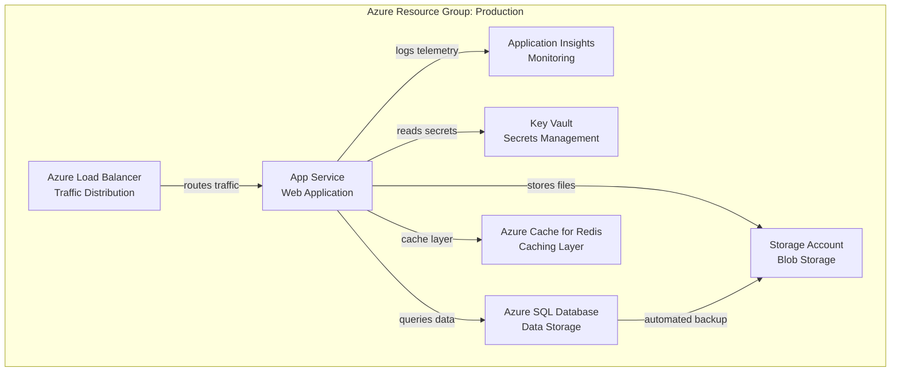
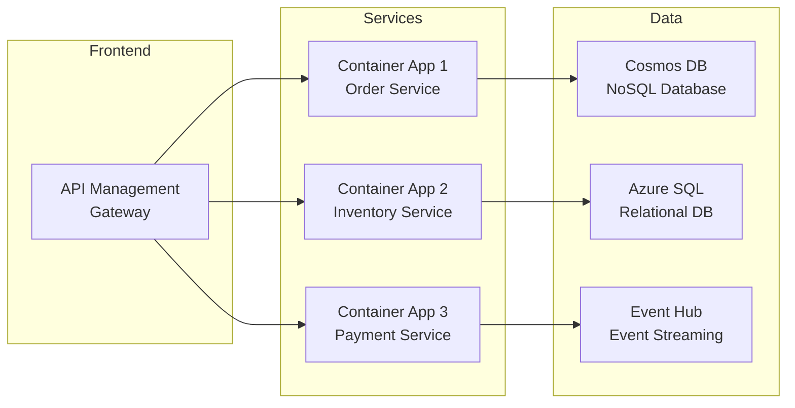

# Azure Resource Visualizer

This skill helps you create visual representations of Azure infrastructure, map resource dependencies, and generate architecture diagrams.

## When to Use This Skill

Use this skill when you need to:
- Visualize Azure resource groups and their contents
- Map dependencies between Azure services
- Create architecture diagrams from existing infrastructure
- Document cloud architecture for stakeholders
- Understand resource relationships and data flows
- Generate infrastructure documentation

## Capabilities

- Query and analyze Azure resources using Azure CLI and PowerShell
- Generate Mermaid and PlantUML diagrams from Azure resources
- Map resource dependencies and relationships
- Create architecture documentation from ARM templates
- Export diagrams in multiple formats (Markdown, SVG, PNG)
- Visualize common Azure architecture patterns

## Prerequisites

- Azure subscription with resources to visualize
- Azure CLI installed and authenticated (`az login`)
- Permissions to read Azure resources (Reader role minimum)
- Understanding of basic Azure resource types

## Quick Start

### List Resources in a Resource Group

```bash
# List all resources
az resource list --resource-group myResourceGroup --output table

# Get detailed resource information
az resource list --resource-group myResourceGroup --output json > resources.json
```

### Generate a Simple Mermaid Diagram

```bash
# Get resources and create a basic diagram
az resource list --resource-group myResourceGroup --query "[].{name:name, type:type}" -o json
```

## Diagram Generation

### Mermaid Diagrams

**Three-Tier Web Application:**



**Microservices Architecture:**



### PowerShell Resource Analysis Script

```powershell
# Analyze and visualize Azure resources
param(
    [Parameter(Mandatory=$true)]
    [string]$ResourceGroupName
)

# Get all resources
$resources = az resource list --resource-group $ResourceGroupName | ConvertFrom-Json

Write-Host "# Azure Resource Group: $ResourceGroupName" 
Write-Host ""
Write-Host "```mermaid"
Write-Host "graph TB"

# Group resources by type
$resourcesByType = $resources | Group-Object -Property type

foreach ($group in $resourcesByType) {
    $typeName = $group.Name.Split('/')[-1]
    Write-Host "    subgraph `"$typeName Resources`""
    
    foreach ($resource in $group.Group) {
        $safeName = $resource.name -replace '[^a-zA-Z0-9]', ''
        Write-Host "        $safeName[`"$($resource.name)`"]"
    }
    
    Write-Host "    end"
}

Write-Host "```"

# Analyze dependencies
Write-Host ""
Write-Host "## Resource Dependencies"
Write-Host ""

foreach ($resource in $resources) {
    $details = az resource show --ids $resource.id 2>$null | ConvertFrom-Json
    
    if ($details.properties) {
        Write-Host "### $($resource.name) ($($resource.type))"
        
        # Check for common dependency patterns
        $deps = @()
        
        if ($details.properties.serverFarmId) {
            $deps += "App Service Plan: $($details.properties.serverFarmId.Split('/')[-1])"
        }
        if ($details.properties.storageAccountId) {
            $deps += "Storage Account: $($details.properties.storageAccountId.Split('/')[-1])"
        }
        if ($details.properties.subnet) {
            $deps += "Subnet: $($details.properties.subnet.id.Split('/')[-1])"
        }
        
        if ($deps.Count -gt 0) {
            foreach ($dep in $deps) {
                Write-Host "- $dep"
            }
        }
        Write-Host ""
    }
}
```

### Node.js ARM Template Visualizer

```javascript
const fs = require('fs');

function visualizeARMTemplate(templatePath) {
    const template = JSON.parse(fs.readFileSync(templatePath, 'utf8'));
    const resources = template.resources || [];
    
    console.log('```mermaid');
    console.log('graph TB');
    console.log('    subgraph "ARM Template Resources"');
    
    // Create nodes
    resources.forEach((resource) => {
        const name = resource.name.replace(/[\[\]'"\(\)]/g, '').replace(/[^a-zA-Z0-9]/g, '_');
        const type = resource.type.split('/').pop();
        console.log(`        ${name}["${type}<br/>${resource.name}"]`);
    });
    
    console.log('    end');
    
    // Create edges from dependsOn
    resources.forEach((resource) => {
        if (resource.dependsOn && Array.isArray(resource.dependsOn)) {
            const sourceName = resource.name.replace(/[\[\]'"\(\)]/g, '').replace(/[^a-zA-Z0-9]/g, '_');
            
            resource.dependsOn.forEach(dep => {
                // Extract resource name from dependency string
                const depMatch = dep.match(/\[.*?'([^']+)'/);
                if (depMatch) {
                    const targetName = depMatch[1].replace(/[^a-zA-Z0-9]/g, '_');
                    console.log(`    ${sourceName} -->|depends on| ${targetName}`);
                }
            });
        }
    });
    
    console.log('```');
}

// Usage
if (process.argv.length < 3) {
    console.error('Usage: node visualize.js <path-to-template.json>');
    process.exit(1);
}

visualizeARMTemplate(process.argv[2]);
```

## Common Architecture Patterns

### Pattern 1: Web Application with Database

```
[Azure Front Door] -> [App Service]
                          |
                          +-> [Azure SQL Database]
                          +-> [Key Vault (Secrets)]
                          +-> [Application Insights]
                          +-> [Blob Storage]
```

### Pattern 2: Event-Driven Serverless

```
[Event Grid] -> [Azure Functions]
                     |
                     +-> [Cosmos DB]
                     +-> [Service Bus]
                     +-> [Event Hub]
```

### Pattern 3: Container-Based Microservices

```
[Azure Container Registry] -> [Azure Kubernetes Service]
                                      |
                                      +-> [Service Mesh]
                                      +-> [Azure Monitor]
                                      +-> [Managed Databases]
```

## Visualization Tools

### Recommended Tools

1. **Mermaid.js** - Text-based diagrams (best for version control)
   - Live editor: https://mermaid.live
   - Supports GitHub, Azure DevOps markdown

2. **PlantUML** - UML diagrams with Azure library
   - Azure icons: https://github.com/plantuml-stdlib/Azure-PlantUML
   - Great for detailed technical diagrams

3. **Draw.io (diagrams.net)** - Visual editor
   - Azure stencils included
   - Export to multiple formats

4. **Azure Resource Graph** - Query at scale
   - KQL queries for complex analysis
   - Export to CSV, JSON

## Best Practices

### Documentation

- **Keep diagrams in version control** (use text-based formats like Mermaid)
- **Update diagrams when infrastructure changes**
- **Use consistent naming conventions** in diagrams
- **Add legends** to explain symbols and colors
- **Document data flow directions** clearly

### Organization

- **Group related resources** using subgraphs
- **Use color coding** for different environments (dev, staging, prod)
- **Tag resources** in Azure for easier filtering
- **Create layered diagrams** (network, compute, data, security)

### Security

- **Don't expose sensitive details** in diagrams (IPs, keys, connection strings)
- **Control access** to architecture diagrams
- **Redact confidential information** before sharing
- **Use generic labels** for sensitive components

## Advanced Queries

### Azure Resource Graph Queries

```kusto
// Find all resources in a resource group
Resources
| where resourceGroup == "myResourceGroup"
| project name, type, location, tags

// Map dependencies between resources
Resources
| where resourceGroup == "myResourceGroup"
| extend dependencies = properties.dependsOn
| project name, type, dependencies

// Resources by location and type
Resources
| summarize count() by location, type
| order by count_ desc
```

### Export Resources to JSON

```bash
# Export all resources with full details
az group export \
    --name myResourceGroup \
    --output json > infrastructure.json

# Query specific resource types
az resource list \
    --resource-group myResourceGroup \
    --resource-type "Microsoft.Web/sites" \
    --output json
```

## Integration with CI/CD

### Generate Diagram in Pipeline

```yaml
# Azure DevOps Pipeline
steps:
- task: AzureCLI@2
  inputs:
    azureSubscription: 'MyAzureSubscription'
    scriptType: 'bash'
    scriptLocation: 'inlineScript'
    inlineScript: |
      # Export resources
      az resource list --resource-group $(ResourceGroup) -o json > resources.json
      
      # Generate diagram (using custom script)
      node generate-diagram.js resources.json > architecture.md
      
- task: PublishBuildArtifacts@1
  inputs:
    pathToPublish: 'architecture.md'
    artifactName: 'architecture-docs'
```

## References

- [Azure Resource Graph](https://docs.microsoft.com/azure/governance/resource-graph/)
- [Azure Architecture Center](https://docs.microsoft.com/azure/architecture/)
- [Azure Architecture Icons](https://docs.microsoft.com/azure/architecture/icons/)
- [Mermaid Documentation](https://mermaid-js.github.io/)
- [PlantUML Azure Library](https://github.com/plantuml-stdlib/Azure-PlantUML)
- [Azure CLI Reference](https://docs.microsoft.com/cli/azure/)
